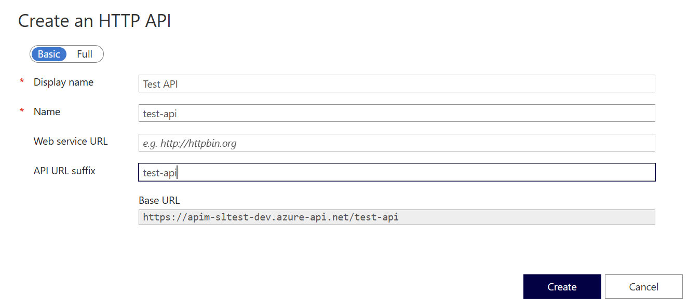
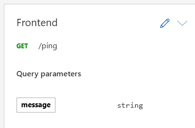
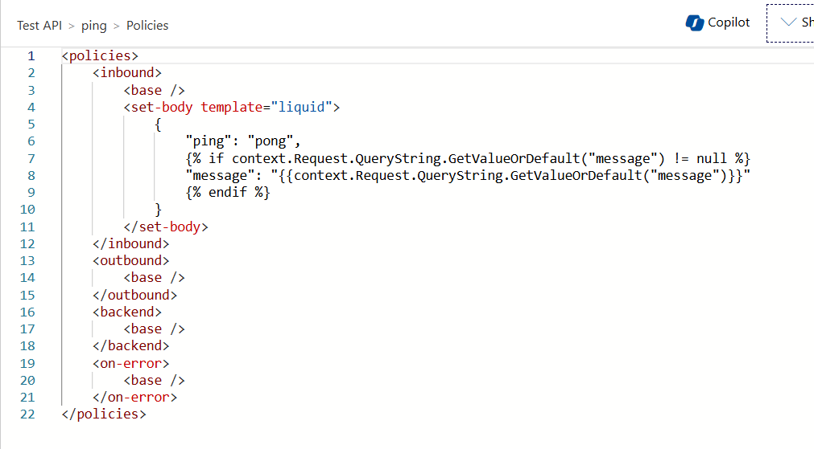

# Walkthrough

This document provides a walkthrough of using the `az-apim-tf-export` extension to export the configuration of an Azure API Management service to a Terraform module and apply the configuration to a new API Management (APIM) service.

The walkthrough works with two environments: `dev` and `test`.
Terraform will be used to create the infrastructure for both environments.
The `dev` environment will be used to author the APIs in APIM.
Then the  and the configuration will be exported to Terraform and applied to the `test` environment.

## Step 1: Set up the `.env` file

Copy the `.env.sample` file to a new file called `.env` and update the values with your own.

These values will be used by the Terraform deployment when creating the environments

## Step 2: Create the environments

Run the following commands to create the `dev` and `test` environments:

```bash
# Run terraform init
make terraform-init

# Deploy a "dev" environment
make deploy-dev

# Deploy a "test" environment
make deploy-test
```

## Step 3: Create an API in the `dev` environment

Navigate to the `dev` environment in the Azure portal and create an API in APIM.



(Optional) Create an API operation.



(Optional) Configure diagnostics for the API.



## Step 4: Export the configuration

Once you have created your  API(s) in the `dev` environment, you can export the configuration to Terraform.
To do this, you will need to run the `az apim export-to-terraform` command as shown below:

```bash
# run this from the root of the repo
APIM_SERVICE_NAME=$(cd example && terraform output -state=dev.tfstate -raw apim_service_name)
az apim export-to-terraform \
  --resource-group apim-tf-export-dev \
  --service-name "$APIM_SERVICE_NAME" \
  --config ./example/export-config.json \
  --output-folder ./example/apim-generated
```

You will see output similar to the following for the APIs/Products you have created showing the progress of the export.

```
Exporting API Management configuration to Terraform...

========== Exporting Products ==========

========== Exporting APIs ==========
API: test-api
  Environments: ['test']
  Operation: ping

========== Exporting API Version Sets ==========
```

Once the export is complete, you will see a new folder called `apim-generated` in the `example` folder.
This folder will have a Terraform file for each API and Product that was exported.
Additionally, there are `apis` and `products` folders that container any schemas and policies that were exported.

Now that the configuration has been exported to the `apim-generated` Terraform module you can include it in the Terraform code.
To do this, find the commented out section for the `apim-generated` module in `main.tf` file and uncomment it.


## Step 5: Apply the configuration to the `test` environment

Now that the Terraform code includes the generated module with the API/Product configuration, you can apply the configuration to the `test` environment:

```bash
# Re-run terraform init to set up new module
make terraform-init

# Re-run the deployment for the "test" environment
make deploy-test
```

Once the deployment is complete, navigate to the `test` environment in the Azure portal and verify that the APIs and Products have been created.

## Summary

In this walkthrough you created two environments `dev` and `test`.
You created an API in the `dev` environment and exported the configuration to Terraform.

This same process can be repeated as new APIs and Products are created via the Azure portal in the `dev` environment:

1. Add or update APIs and Products in the `dev` environment
2. Export the configuration to Terraform
3. Apply the configuration to the `test` environment

The export configuration for the walkthrough is in the `example/export-config.json` file.
This file tells the export to include all APIs and Products and deploy them to the `test` environment.
If you have more environments or want to include/exclude specific APIs/Products, you can update this file accordingly.
See the [README](../README.md) for more information on the configuration file.


